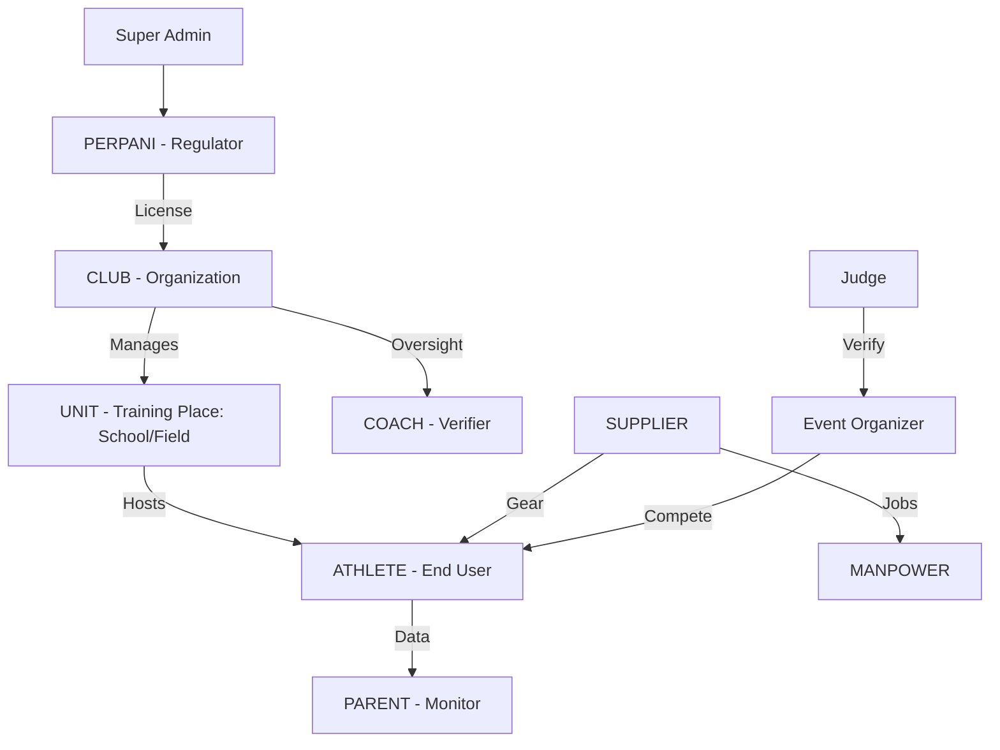

# 🎯 SIP Ecosystem Blueprint (v3.0)

> **Vision**: Connect the entire Indonesian archery ecosystem through a single, unified digital platform—empowering athletes, clubs, and governing bodies with data-driven insights and streamlined operations.

| 📅 Created | 🔄 Last Updated | 🏷️ Version |
|------------|-----------------|-----------|
| 2026-01-06 | 2026-01-24 08:15 | 3.1.0 (Production Live) |

---

## 📊 1. Ecosystem Overview

SIP is built on a **Network-of-Networks** model. Each user is anchored by a master identity (NIK) but can hold multiple roles across the ecosystem. The core physical activity happens at the **Unit** level (Schools, Fields) which are managed by a **Club**.

---

## 📋 2. Master Roadmap (System Calibration)

### Phase 1: Infrastructure & ID ✅
- [x] Unified SIP ID Format (`{RoleCode}.{PPCC}.{Sequence}`)
- [x] Multi-Role RBAC (Role-Based Access Control)
- [x] Dynamic Sidebar Engine (Sidebar 2.0)

### Phase 2: Core User Lifecycles ✅
- [x] **The Athlete's Journey**: Scoring, Bleep Test, Progress charts.
- [x] **The Parent's Portal**: Peace-of-mind monitoring, easy payments.
- [x] **The Admin's Command Center**: Member approvals, inventory, group invoicing.
- [x] **Unit Management**: Defining training venues (Schools/Fields) under Clubs.

### Phase 3: Vertical Specialization ✅
- [x] **Jersey Logistics**: Production stations, QC Station, Shipping integration.
- [x] **Event Management**: IanSEO integration, registration, certificate designer.
- [x] **Sports Science**: ACWR monitoring, shot bias analysis, heart rate logs.

### Phase 12: Production Restore Point Sync ✅ (LIVE)
- [x] Idempotent Data Seeding (Upsert)
- [x] Schema Standardization (ClubUnit Constraints)
- [x] Production Environment Calibration (.env parity)
- [x] Live Deployment on Render (https://sip-api-g7s3.onrender.com)

### Phase 14: Workspace Stabilization ✅
- [x] TypeScript RootDir & Prisma Include fixes
- [x] Migration Sanitization Logic cleanup
- [x] Build Error resolution (100% clean `tsc`)

### Phase 27: Marketplace 'Unified Pro' Layout ✅
- [x] **Unified Header Logic**: Seamless integration with OS navigation.
- [x] **Centered Ergonomics**: Auto-sidebar collapse and zero-margin grid.
- [x] **Hero Branding**: High-impact banner for featured gear.
- [x] **Mobile Menu Fix**: Z-Index conflict resolution for overlay modes.

### Phase 4: Lifecycle Optimization (NEXT SESSION) ⏳
- [ ] **Multi-Role Flow**: Full RBAC isolation and switching persistence.
- [ ] **Unified Onboarding**: Automatic existing-user detection and role request redirection.
- [ ] **Onboarding Verification**: Password-based verification during the onboarding flow.

---

## 🧩 4. System Modules & Feature Matrix

The SIP ecosystem is divided into **Lego-style Modules**. Some are **Foundation** (Universal) and others are **Domain-Specific** (Role-based).

### 4.1 Module Categories

| Category | Purpose | Included Features |
| :--- | :--- | :--- |
| **FOUNDATION** | Core Identity | Auth, Multi-Role Profile, File Manager, Notifications, Digital ID. |
| **SPORT** | Archery Logic | Scoring, Bleep Test, Training Schedules, Attendance, Archer Config. |
| **COMMERCE** | Financials | Club Invoicing, Member Fees, Inventory, Product Catalog. |
| **OPS** | Manufacturing | Production Timeline, QC Station, Warehouse Logistics. |
| **ADMIN** | Ecosystem Mgmt | Role Approvals, User Audit, Regional Oversight (PERPANI). |

### 4.2 Shared vs. Special Features

| Feature | Type | Suggestion for UX |
| :--- | :--- | :--- |
| **Self-Service Dashboard** | **Shared** | Provide "Quick Actions" widgets tailored to the active role. |
| **Digital ID Card** | **Shared** | Must be accessible in < 1s via a permanent Sidebar/Header icon. |
| **Dynamic Scoring** | **Special** | Athlete: Large buttons for field use | Judge: Multi-view for group validation. |
| **Member Approval** | **Special** | Organization: Show "Pending" count as a red badge in the sidebar for urgency. |
| **QC Station** | **Special** | Manpower: Optimized for Tablet/Handheld with QR/Barcode scanner autofocus. |

---

## 🔄 5. Functional Lifecycle Workflows

### 5.1 The Archer’s Journey (Athlete + Parent)
**Goal**: Mastery and Progress Tracking across training sites.

1. **Local Intake**: Athlete joins a **Unit** (School or Field).
2. **Daily Log**: Open SIP → Scan **Unit QR** (Attendance) → Check today's Schedule at that specific location.
3. **Execution**: Start Scoring → Log Arrows → (Optional) Rate Session RPE.
4. **Progression**: Athlete shows progress at Unit level → Invited to the **Parent Club** for advanced training/competition.
5. **Visibility**: Parent receives notification of completed session → Views achievement badges.

### 5.2 The Organization Command (Club + School)
**Goal**: Multi-site Operational Efficiency and Member Growth.

1. **Structural Setup**: Club defines multiple **Units** (Training Venues) within their dashboard.
2. **Gatekeeping**: Review Join Requests for specific Units → Approve & Assign SIP ID.
3. **Scheduling**: Create Training Bloc per Unit → Assign Coaches → Auto-generate **Location-specific Attendance QR**.
4. **Treasury**: Bulk-generate Monthly Invoices (Unified across all Units) → Track Payment Uploads.
5. **Insights**: Dashboard KPI check (Growth trends by Unit, Total Club members).

### 5.3 The Manufacturing Pipeline (Supplier + Manpower)
**Goal**: Zero-Defect Production.

1. **Order Intake**: Order received from Jersey Shop → Auto-placed in Production Queue.
2. **Execution**: Admin assigns task → Manpower scans barcode → "Clock-in" to Workstation.
3. **Validation**: Finished item reaches QC Station → Manpower runs Inspection Checklist → Mark "Ready for Ship".
4. **Logistics**: Logistics desk assigns Courier → AWB auto-generated → Customer notified.

---

## ⚙️ 6. Technical Standards & Protocols

### 4.1 SIP ID Protocol
SIP IDs are hierarchical to ensure regional and role-based isolation.
`XX.YYYY.ZZZZ`
- `XX`: Role Code (00=Admin, 02=Club, 04=Athlete, 10=Manpower)
- `YYYY`: Province/City Code (PPCC)
- `ZZZZ`: Auto-incrementing sequence

### 4.2 Security & Data Integrity
- **NIK Isolation**: Personally identifiable info (PII) is encrypted at rest.
- **Role Context Isolation**: Switching roles in the UI triggers a `force-purge` of the React context to prevent data leakage.
- **Audit Logging**: Every action involving a change in status (Order paid, Member approved) creates a permanent ledger entry.

---

## 🛰️ 5. Sports Science & Analytics

### 5.1 ACWR (Acute:Chronic Workload Ratio)
Ensuring archers don't overtrain.
- **Formula**: `Rolling 7-day Load` / `Average 28-day Load`.
- **Sweet Spot**: 0.8 - 1.3 (Green Zone).
- **Injury Risk**: > 1.5 (Red Alert).

### 5.2 Shot Bias Tracking
Analyzing group patterns (High/Low/Left/Right bias) to suggest specific form corrections or equipment tuning (Plunger/Nocking Point).

---

## 🔧 6. Development Protocols

### Env Strategy
- **Frontend**: Vite (PWA Enabled) - Vercel Deployment.
- **Backend**: Express + Prisma - Render Deployment.
- **Database**: Dual-Stage (SQLite dev.db / PostgreSQL Project Neon).

### File Safety Rule
> [!CAUTION]
> Never use shell redirection (>>). Use `copy /b file.ts +,,` to update timestamps.

---

## 🎯 7. Success Metrics (KPIs)
- **Time to Score**: Athlete must be able to log a score in < 3 taps from home.
- **Admin Visibility**: Club admins must know their total members within 2 seconds of login.
- **System Stability**: 99.9% uptime for field operations (Attendance/Scoring).

---
> Version: 3.0.0 | Updated by SIP Core Intelligence
