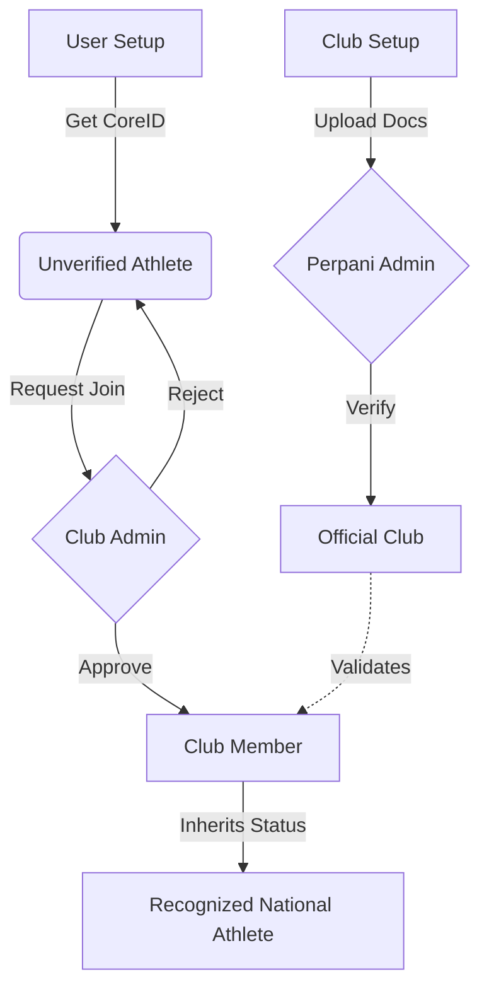

# 🔗 Csystem Ecosystem Integration: The Trust Chain
**"Simplified Flow for Athlete, Club, & Federation (Perpani)"**

> **Core Philosophy:** "Distributed Trust"
> Instead of the Federation verifying every single Athlete (Bottleneck), we build a **Chain of Trust**.
> **Perpani trusts the Club** → **The Club trusts the Athlete**.

---

## 1. The Big Picture (Concept)

The ecosystem is built on 3 layers of verification.

1.  **Layer 1 (Identity):** The **User** asserts who they are (NIK, Name).
2.  **Layer 2 (Community):** The **Club** validates the User exists and is active.
3.  **Layer 3 (Legitimacy):** The **Federation** validates the Club is a legal entity.

This creates a **"Green Checkmark Chain"**. If a Club is Green (Verified), all its Members inherit that "Legitimate" status contextually.

---

## 2. The User Journey (Simplified)

### 🟢 Phase A: The Athlete (Self-Sovereign)
*Zero Friction. Anyone can start.*

1.  **Sign Up**: User enters basics (Email, Password).
2.  **Profile Completion**: User enters NIK, DOB, Gender.
    *   *System Action:* Generates **CoreID** (Unverified).
    *   *System Action:* User gets a **Gray Badge** (Unverified Account).
3.  **Digital Card**: User has a QR code, but it says "Clubless / Unverified".

### 🟡 Phase B: Finding a Home (Club Integration)
*The First Filter. Physical Verification.*

1.  **Join Club**:
    *   User searches for a Club (e.g., "Eagle Archery").
    *   User clicks **"Request to Join"**.
2.  **Club Approval**:
    *   Club Admin gets notification.
    *   Club Admin checks: "Do I know this person? Have they paid registration?"
    *   Club Admin clicks **"Approve"**.
3.  **Result**:
    *   User profile now calculates: **"Member of Eagle Archery"**.
    *   User inherits Club's status.
    *   **CoreID** updates to reflect Club affiliation.

### 🔵 Phase C: The Gold Standard (Federation Integration)
*The Official Seal. Legal Verification.*

1.  **Club Registration**:
    *   Club Admin uploads legal docs (SK Menkumham, Domisili) to **Perpani Portal**.
2.  **Perpani Approval**:
    *   Perpani Admin reviews documents.
    *   Perpani Admin clicks **"Verify Club"**.
3.  **The Ripple Effect (Key Simplification)**:
    *   **Club** gets "Perpani Verified" Badge (Gold).
    *   **ALL Members** of that Club automatically get "Perpani Affiliated" status on their profiles.
    *   *Benefit:* Athletes don't need to apply to Perpani individually for basic recognition.

---

## 3. Implementation Steps (Technical)

To achieve this "Simple Flow", we need:

### Step 1: UI/UX Refinements
- [ ] **Role Badges**: Add clear visual cues on the Profile (Gray/Green/Gold ticks).
- [ ] **Onboarding Wizard**: After signup, ask "Are you part of a club?" -> Redirect to Club Search.
- [ ] **Club "Verified" Status**: Needs a database flag `Club.isVerifiedByFederation`.

### Step 2: The "Guarantee" Logic
- Users cannot manually claim "I am a National Athlete".
- ONLY a **Verified Club** can mark a member as "Elite/Competition Ready" (if we want tiered athlete status).

### Step 3: Perpani Dashboard (Future)
- A simple view for Perpani Admins to see "Pending Club Applications" (similar to how Clubs see Pending Member Requests).

---

## 4. Visual Summary for Users

---

## 5. Benefits

1.  **For Perpani**: Reduces workload by 99%. Only verify ~500 Clubs, not ~50,000 Athletes.
2.  **For Clubs**: Gives them power. They are the gatekeepers.
3.  **For Athletes**: One click "Join". No complex paperwork if the Club is already done.
